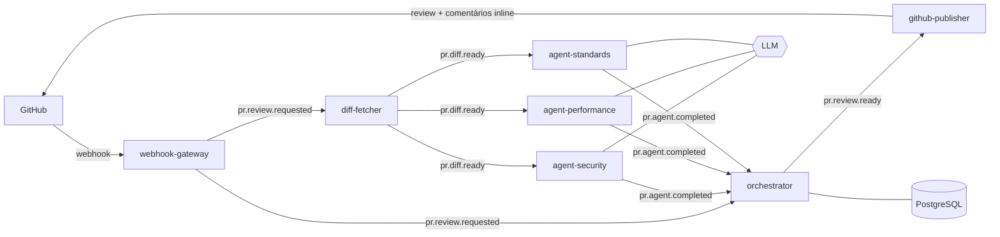

# PR Sentinel

Revisor de código multi-agente para Pull Requests do GitHub. Quando um PR é aberto ou atualizado, três agentes de IA especializados (segurança, performance e padrões) analisam o diff em paralelo, um orquestrador consolida os resultados e a review é publicada direto no PR.

> 🚧 Em construção. Veja o [roadmap](#roadmap).

## Arquitetura



Todos os eventos passam por um topic exchange no RabbitMQ (`pr-sentinel.events`). Cada consumidor tem sua própria fila com DLQ.

| Módulo | Responsabilidade |
|---|---|
| `common` | Contratos de eventos (records) e topologia de mensageria |
| `webhook-gateway` | Valida assinatura HMAC do GitHub e publica `pr.review.requested` |
| `diff-fetcher` | Busca, filtra e divide o diff em chunks |
| `review-agent` | Analisa o diff com o LLM; o tipo de agente vem de `AGENT_TYPE` |
| `orchestrator` | Estado da review, consolidação, deduplicação e timeout |
| `github-publisher` | Publica a review no PR respeitando rate limits |

## Decisões técnicas

- **Um módulo, três agentes.** `review-agent` é o mesmo código rodando em três containers com `AGENT_TYPE` diferente. Muda só o prompt (`prompts/*.st`) e a fila. Adicionar um novo agente é criar um prompt e um container.
- **Fan-out via filas independentes.** Cada agente tem sua própria fila ligada a `pr.diff.ready`, então um agente lento ou fora do ar não bloqueia os outros.
- **Review parcial em vez de falha total.** Se um agente estoura o timeout, o orchestrator publica o que tem e indica qual agente não respondeu.
- **Saída estruturada.** Os agentes devolvem JSON validado contra um schema, e achados com confiança abaixo de 0.6 são descartados para reduzir falsos positivos.
- **Comparação HMAC em tempo constante** (`MessageDigest.isEqual`) para evitar timing attacks no webhook.

## Rodando localmente

Pré-requisitos: Java 21, Maven, Docker.

```bash
cp .env.example .env          # preencha as variáveis
mkdir secrets                 # coloque a chave do GitHub App em secrets/github-app.pem
docker compose up --build
```

- Webhook: `http://localhost:8080/webhooks/github`
- Painel do RabbitMQ: `http://localhost:15672` (guest/guest)

Para receber webhooks reais em localhost, use [smee.io](https://smee.io) ou ngrok apontando para a porta 8080.

### Criando o GitHub App

1. GitHub → Settings → Developer settings → GitHub Apps → New GitHub App
2. Webhook URL: sua URL do smee/ngrok + `/webhooks/github`
3. Webhook secret: o mesmo valor de `GITHUB_WEBHOOK_SECRET`
4. Permissões: **Pull requests** (read & write), **Contents** (read)
5. Eventos: **Pull request**
6. Gere a private key e salve em `secrets/github-app.pem`
7. Instale o App no repositório de teste

## Testes

```bash
mvn verify
```

## Roadmap

- [x] Fase 1 — Estrutura de módulos, contratos de eventos, modelo de dados
- [ ] Fase 2 — webhook-gateway com idempotência
- [ ] Fase 3 — diff-fetcher + autenticação do GitHub App
- [ ] Fase 4 — agente de segurança ponta a ponta, com testes
- [ ] Fase 5 — agentes de performance e padrões + orchestrator
- [ ] Fase 6 — github-publisher e review real num repositório de teste
- [ ] Fase 7 — observabilidade (Micrometer), evals, métricas de custo

## Stack

Java 21 · Spring Boot 3.5 · Spring AI · RabbitMQ · PostgreSQL · Flyway · Docker Compose · Testcontainers · GitHub Actions
